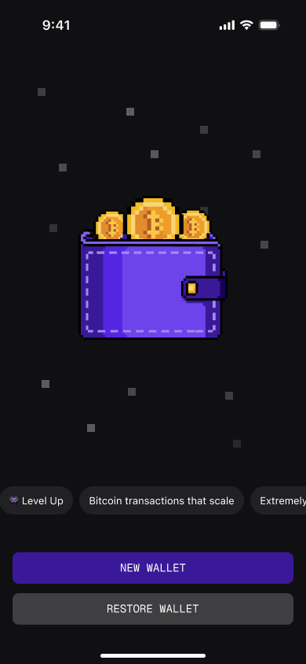
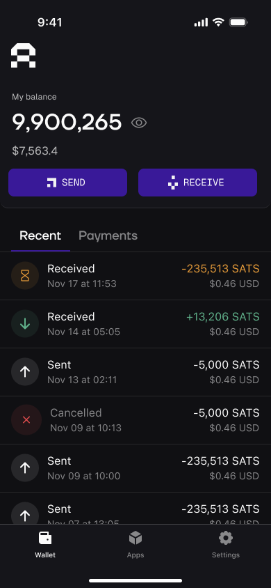

# Arkade Wallet

Arkade Wallet is a modern self-custodial **Bitcoin** wallet built as a Progressive Web App (PWA). It includes native support for the ARK protocol, enabling users to interact seamlessly with [arkd](https://github.com/arkade-os/arkd) instances. The wallet allows users to handle Virtual Transaction Outputs (VTXOs), facilitating offchain Bitcoin transactions with instant pre-confirmations and secure eventual onchain settlement, all without giving up custody or requiring protocol changes to Bitcoin.

## Screenshots

<!-- Using a table for more consistent layout -->
<table>
  <tr>
    <td width="50%" align="center">
      <h3>New Wallet Creation</h3>
      
    </td>
    <td width="50%" align="center">
      <h3>Home Screen</h3>
      
    </td>
  </tr>
</table>

## Getting Started

### Prerequisites

- Node.js >=18
- PNPM >=8

### Installation

Install dependencies

   ```bash
   pnpm install
   ```

## Development

### `pnpm run start`

Runs the app in the development mode.\
Open [http://localhost:3002](http://localhost:3002) to view it in the browser.

The page will reload if you make edits.\
You will also see any lint errors in the console.

### `pnpm run build`

Builds the app for production to the `dist` folder.\
It correctly bundles React in production mode and optimizes the build for the best performance.

The build is minified and the filenames include the hashes.\
Your app is ready to be deployed!
